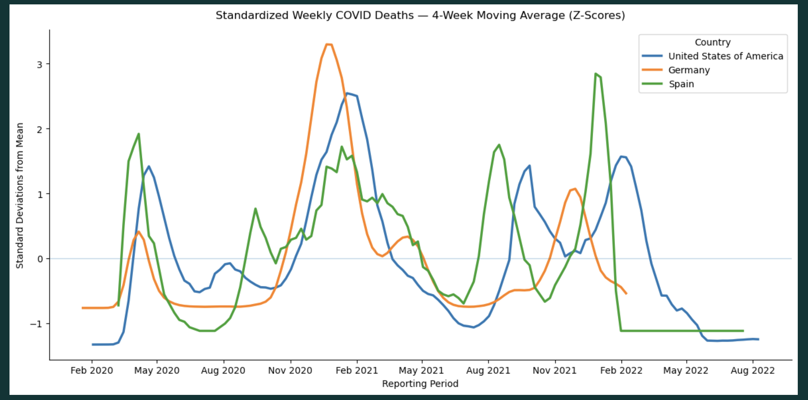
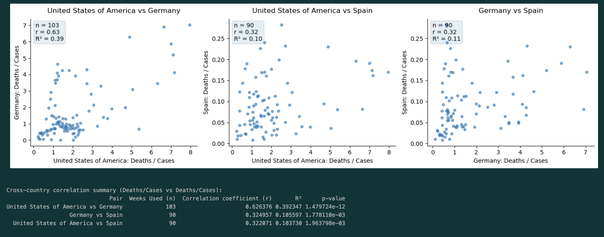
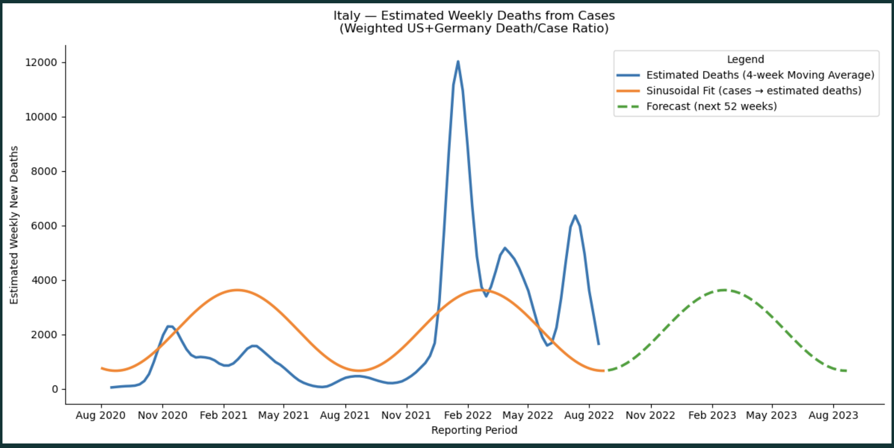
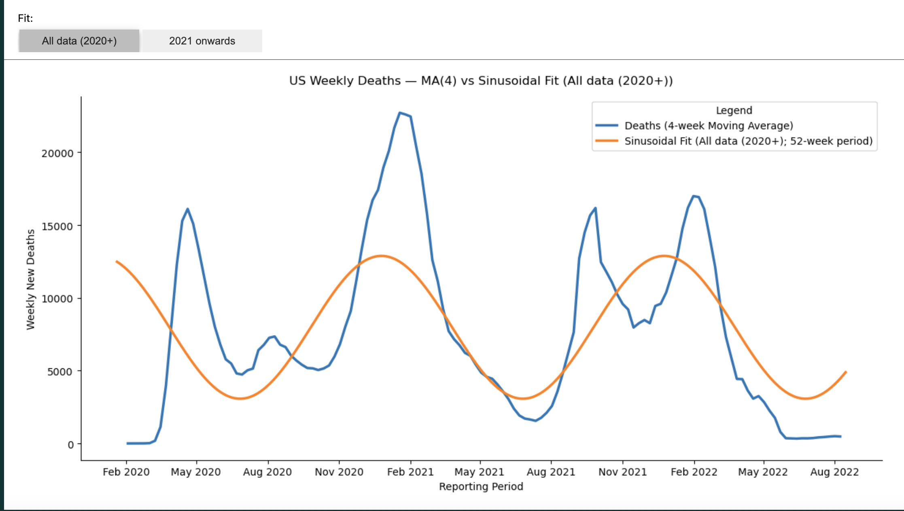
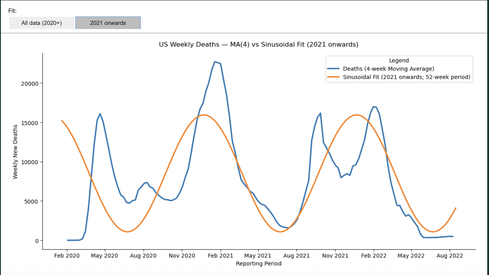
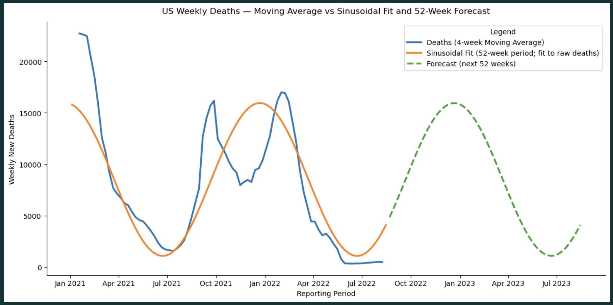
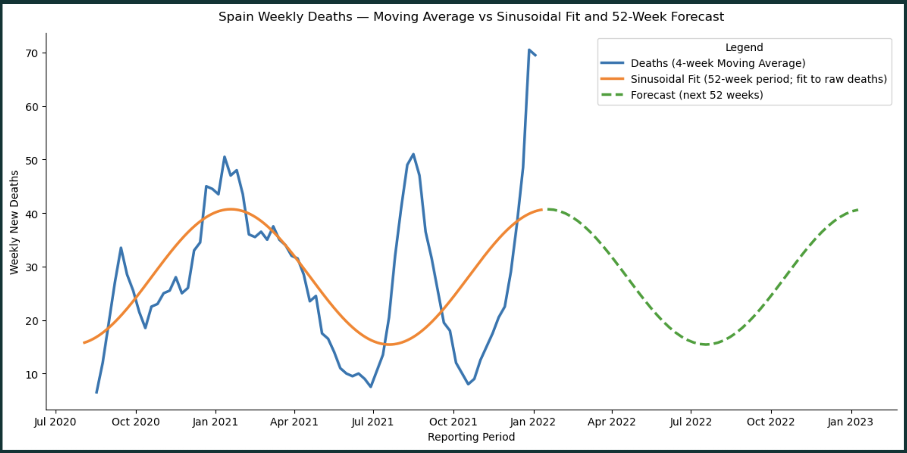

# Messy Data Forecasting — COVID Case/Death Signals (US, Germany, Spain, Italy)

**Author:** Sam Ginzburg  
**Email:** samginzee@gmail.com  
**Tech Stack:** Python · Pandas · NumPy · Matplotlib · Time Series Analysis  

---

## Business Problem & Motivation  

Real-world public health data is rarely clean, consistent, or analysis-ready. Metrics are reported at different temporal granularities, cumulative and incremental values are mixed, and data quality varies significantly across regions.

The goal of this project is to demonstrate how a data analyst can:

- Ingest and reconcile heterogeneous real-world datasets  
- Apply thoughtful data-cleaning and aggregation strategies  
- Identify data quality limitations and adapt methodology accordingly  
- Build interpretable, assumption-aware forecasts under imperfect conditions  

Rather than producing high-confidence predictions, this project emphasizes **analytical judgment, transparency, and disciplined modeling** when working with messy data.

---

## Project Scope  

This project delivers an end-to-end analytical case study that:

- Loads and cleans multiple public health datasets (via a modular Python ETL pipeline)
- Resolves inconsistent temporal structures through weekly aggregation
- Handles cumulative vs. incremental metrics to prevent double-counting
- Merges static and time-varying data responsibly
- Analyzes cross-country differences in data quality and reporting
- Applies seasonal regression models to forecast COVID-related mortality trends
- Adapts forecasting strategy when critical data is missing (Italy)

The project is intentionally scoped as an **analytical and forecasting exercise**, not a clinical or policy-making tool.

---

## Methods & Skills Demonstrated  

### Tooling & Technical Stack

- **Python** — data pipelines, exploratory analysis, forecasting
- **Pandas** — cleaning, joins, grouping, time-series transformations
- **NumPy / SciPy** — numerical operations, sinusoidal regression
- **Matplotlib** — publication-style visualizations and annotations
- **Time-Series Aggregation** — daily → weekly alignment
- **ETL & Data Pipelines** — modular ingestion, cleaning, and aggregation with explicit safeguards against temporal leakage and cumulative double-counting

### Analytical Methods & Judgment

- **Data Cleaning & Validation**  
  Type coercion, missing-value handling, finite checks, date parsing, de-duplication, and weekly aggregation
- **Outlier & Scale Management**  
  Percentile capping, conservative filters, indexed series, and z-score standardization for cross-country comparisons
- **Statistical Analysis**  
  Pearson correlations, R² interpretation, aligned reporting windows, and pairwise country comparisons
- **Seasonal Time-Series Modeling**  
  Fixed-period (52-week) sinusoidal regression, moving averages, and forward projections
- **Decision-Making Under Data Constraints**  
  Explicit handling of unreliable reporting (Spain) and creative proxy-based estimation where data was unavailable (Italy)
- **Transparent Communication of Assumptions**  
  Clear documentation of modeling choices, time-window selection (2020+ vs 2021+), and limitations (“garbage in, garbage out”)


---

## Analytical Approach  

### Data Preparation  

- Filtered datasets to retain only analytically relevant columns  
- Standardized dates and aggregated uneven daily data into weekly intervals  
- Reconstructed cumulative metrics from incremental values to avoid inflation  
- Preserved static variables (e.g., population) during temporal joins  
- Applied country and date filters prior to aggregation to prevent leakage  

### Modeling Strategy  

- Identified consistent seasonal patterns in mortality data across countries  
- Selected sinusoidal regression models to capture annual seasonality  
- Applied forecasting only where data quality supported reasonable inference  
- Developed a proxy-based forecasting approach for Italy due to missing death data  

---

## Key Analyses in This Notebook

This project explores COVID-19 mortality patterns across multiple countries using a combination of statistical normalization, correlation analysis, seasonal time-series modeling, and transparent handling of data limitations. Rather than imposing a single modeling approach on inconsistent international datasets, each analysis was tailored to the structure and reliability of the available data.

---

### 1. Cross-Country Trend Comparison Using Standardization (Z-Scores)

Raw COVID death counts vary dramatically by country due to population size, reporting practices, and healthcare capacity. Direct comparison of absolute values obscures meaningful temporal patterns.

To enable comparability, weekly death series were:

- Aggregated to weekly frequency  
- Smoothed using a 4-week moving average  
- Standardized using z-scores (mean = 0, standard deviation = 1)

This transformation allows trends to be compared directionally and temporally, rather than by magnitude alone.

**Key insight:**  
Despite large differences in absolute death counts, the United States, Germany, and Spain exhibit broadly similar seasonal dynamics during major pandemic waves. This reinforces the importance of normalization when comparing international time series.



---

### 2. Cross-Country Correlation Analysis → Creative Modeling for Italy

Rather than correlating raw deaths or case counts, this analysis focused on **weekly deaths-to-cases ratios**, a more comparable severity metric across countries.

Pairwise scatter plots were constructed for:

- United States vs Germany  
- United States vs Spain  
- Germany vs Spain  

Each comparison includes:

- Aligned weekly observations only  
- Pearson correlation coefficients (r)  
- R² values and statistical significance  

**Key insight:**  
The strongest relationship appears between the United States and Germany, indicating similar reporting behavior and epidemic dynamics. Spain’s weaker correlations foreshadow downstream modeling challenges tied to data reliability.

  

#### Extending the Insight: Estimating Deaths for Italy (Missing Outcome Data)

Italy presented a different constraint: **death data was unavailable**, while case data was reliable.

To estimate deaths:

- Weekly deaths-to-cases ratios were computed for the two most statistically aligned countries (U.S. and Germany)
- A weighted average ratio was derived
- Italy’s weekly case counts were converted into estimated deaths
- A sinusoidal seasonal model was fitted to the estimated series
- A 52-week forward projection was generated

This approach leverages **cross-country statistical alignment** to construct a transparent estimator under real-world data constraints.



**Key insight:**  
This section demonstrates analytical problem-solving under imperfect conditions — building a defensible proxy when a key variable is missing, while clearly communicating assumptions and uncertainty.

---

### 3. U.S. Seasonal Modeling — Why Time-Window Selection Matters

To model seasonality in U.S. COVID deaths, a fixed 52-week sinusoidal regression was applied. Two alternative fitting windows were explicitly tested:

- **All available data (2020+)**
- **Post-2021 only**, after early-pandemic reporting volatility stabilized

  


**Key insight:**  
Including early-2020 data materially distorts the seasonal signal due to structural breaks, inconsistent reporting, and pandemic shock effects. Restricting the model to 2021 onward produces a smoother, more interpretable seasonal pattern and a more defensible forecast.

---

### 4. U.S. Forecasting with Explicit Assumptions

Using the preferred post-2021 sinusoidal fit, a 52-week forward projection was generated. Observed deaths were plotted using a 4-week moving average to emphasize trend over noise.



**Key insight:**  
This forecast is not presented as a causal model. It is a seasonality-driven projection intended to illustrate how recurring patterns can be extracted — and cautiously extrapolated — from noisy public-health data.

---

### 5. Spain Case Study — Data Quality and “Garbage In, Garbage Out”

Spain’s reported COVID death data contains significant quality issues, including extended periods reporting zero deaths during known waves of viral activity.

A sinusoidal model was nevertheless applied for demonstration purposes.



**Key insight:**  
While a forecast can always be computed, this section illustrates a core analytical principle:

> Model sophistication cannot compensate for unreliable inputs.

Rather than masking this limitation, the analysis explicitly highlights it — an essential skill in real-world analytics.

---

### Final Takeaway

Across all analyses, the emphasis is not on producing a single “perfect” model, but on:

- Matching methodology to data reality  
- Testing assumptions explicitly  
- Handling imperfect data honestly  
- Communicating limitations clearly  

These are the same trade-offs analysts face in production environments — and the skills this project is designed to showcase.

---

## Project Structure  

```text
Messy_Data_Forecasting_Covid/
├── requirements.txt
├── README.md
├── .gitignore
│
├── src/
│   └── etl/
│       ├── etl.py
│       └── lib/
│           ├── load_data.py
│           ├── clean_data.py
│           ├── merge_data.py
│           └── filter_data.py
│
├── data/
│   ├── final_merge.csv
│   └── raw/ (.gitignore)
│
├── notebooks/
│   ├── final_analysis.ipynb
│   └── analysis_exploration.ipynb
│
└── assets/
    ├── Creative_Correlation_Italy
    ├── Italy_Forecast
    ├── Spain_Forecast_Garbage_In_Garbage_Out
    ├── US_Correlation_Trends
    ├── US_Forecast
    ├── US_2021_Regression
    ├── US_2020_Regression
    └── Z-Score_Country_Comparison
```
---

## How to Run This Project

1. Clone the repository
2. Install dependencies:
   pip install -r requirements.txt
3. Open the final notebook:
   notebooks/final_analysis.ipynb

The exploratory notebook is included for transparency and deeper inspection but is not required to understand the final results.

## Limitations

- Forecasts are trend-based and assume seasonal stability
- External policy changes and behavioral effects are not modeled
- Data quality varies significantly by country
- Results are intended for analytical demonstration, not real-world decision-making

## Disclaimer

This project is for educational and analytical purposes only and does not constitute medical, public health, or policy advice.